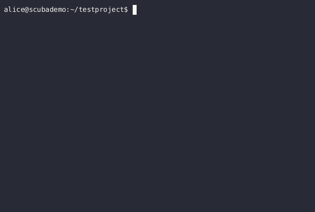

SCUBA     
-----

**SCUBA** is the **S**imple **C**ontainer-**U**tilizing **B**uild **A**pparatus

Scuba makes it easier to use Docker containers in everyday development. It
allows a developer to commit an environment setup where the entire build
environment is encapsulated in a Docker container.

For more information, [Read the Docs](https://scuba.readthedocs.io/).

## License

This software is released under the [MIT License](https://opensource.org/licenses/MIT).
